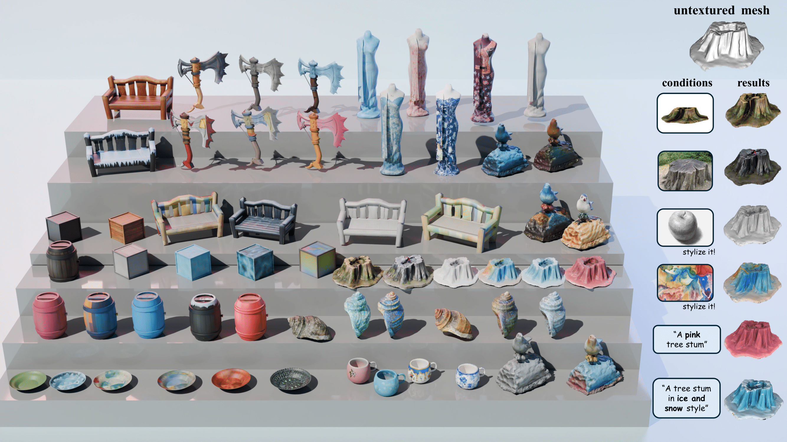

# FlexPainter
[Arxiv 2025] FlexPainter: Flexible and Multi-View Consistent Texture Generation

### [Paper](https://arxiv.org/abs/2506.02620) | [Project Page](https://starydy.xyz/FlexPainter) | [Video](https://www.youtube.com/watch?v=AudeQdTifWY)

> FlexPainter: Flexible and Multi-View Consistent Texture Generation  
> Dongyu Yan*, Leyi Wu*, Jiantao Lin, Luozhou Wang, Tianshuo Xu, Zhifei Chen, Zhen Yang, Lie Xu, Shunsi Zhang, Yingcong Chen  
> Arxiv 2025

  

This repository contains code for the paper FlexPainter: Flexible and Multi-View Consistent Texture Generation, an texture generation method that uses flexible, multi-modal inputs.
